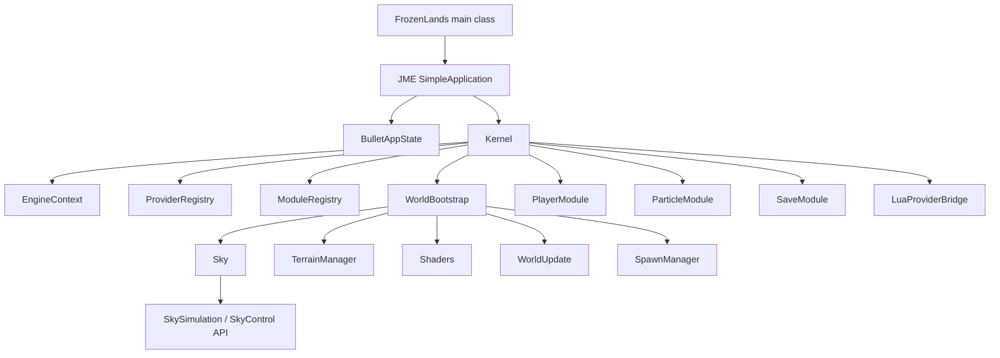

# FrozenLands — initial repository description

> Первичное техническое описание репозитория `FrozenLands-main` и его локальной зависимости `SkySimulation`.
>
> Состояние зафиксировано по структуре и файлам проекта на `2026-06-25`: `build.gradle`, `settings.gradle`, `src/main/java`, `src/main/resources`, `modulesSrc`, `SkySimulation/README.md`, `SkySimulation/build.gradle`, `SkySimulation/common.gradle`, `SkySimulation/SkyLibrary/build.gradle`.

---

## 1. Назначение репозитория

`FrozenLands-main` — Java / jMonkeyEngine 3D game-runtime prototype с рабочим именем **FrozenLands**.

Проект сейчас устроен как Gradle application-проект с точкой входа:

```text
org.takesome.frozenlands.FrozenLands
```

Внутреннее имя Gradle-проекта:

```text
rootProject.name = 'NewGame'
```

Основная роль репозитория:

- запуск JME-приложения;
- инициализация физики через Bullet / Minie;
- регистрация mutable asset roots;
- загрузка runtime-конфигов из `modulesSrc`;
- построение мира: sky, terrain, shaders, particles, spawn, player, save;
- предоставление модульного Java/Lua runtime ABI через `ModuleRegistry`, `ProviderRegistry` и `LuaProviderBridge`.

---

## 2. Локальные пути

```text
Main repository:
C:\Users\Aiden\Documents\Repos\FrozenLands-main

Local dependency repository:
C:\Users\Aiden\Documents\Repos\SkySimulation
```

В операторском workspace эти каталоги видны как:

```text
FrozenLands-main
SkySimulation
```

---

## 3. Высокоуровневая архитектура



### Главный runtime-flow

1. `FrozenLands.main()` создаёт `AppSettings`, выставляет resolution `2560x1440`, samples `16`, title `FrozenLands`.
2. `simpleInitApp()`:
   - регистрирует `src/main/resources` и asset roots из `modulesSrc/**/module.index.json`;
   - читает bootstrap-конфиг `userInput`;
   - инициализирует Lemur GUI;
   - создаёт `BulletAppState`;
   - создаёт `FilterPostProcessor`;
   - подключает `Kernel` как `AppState`.
3. `Kernel` собирает runtime:
   - `ProviderRegistry` + concrete providers: sound, material, model;
   - `ModuleRegistry`;
   - `WorldBootstrap`;
   - `WorldModule`, `TerrainModule`, `ShaderModule`, `ParticleModule`, `PlayerModule`, `SaveModule`;
   - optional runtime manifest reporter.

---

## 4. Основные директории

| Путь | Назначение |
|---|---|
| `src/main/java/org/takesome/frozenlands` | Основной Java-код приложения и базового engine runtime. |
| `src/main/resources` | Базовые assets: модели, материалы, шейдеры, текстуры, UI, звуки, темы Lemur, `log4j2.xml`. |
| `modulesSrc` | Модульная runtime-зона: Java-код модулей, Lua API stubs/events, JSON-конфиги, module index files. |
| `lib` | Локальные библиотеки / binary assets, если используются проектом. |
| `logs` | Runtime/build logs. |
| `gradle`, `gradlew`, `gradlew.bat` | Gradle wrapper. |
| `build.gradle` | Основной Gradle build script приложения. |
| `settings.gradle` | Имя Gradle root project: `NewGame`. |

В `src/main/resources` сейчас присутствуют ассеты следующих типов:

```text
Models, MatDefs, sounds, textures, themes, ui
png, ogg, jpg, json, j3m, dds, glb, j3o, shader files, xml/groovy configs
```

---

## 5. Java runtime modules

Модули объявляются через файлы:

```text
modulesSrc/**/module.index.json
```

`ModuleIndexCatalog` сканирует `modulesSrc`, читает каждый `module.index.json` и предоставляет:

- наличие модуля по id;
- путь к runtime config;
- путь к Lua API/events;
- список asset roots;
- чтение JSON через mutable filesystem path или JME `AssetManager`.

### Обнаруженные runtime-модули

| Module ID | Назначение |
|---|---|
| `engine.bootstrap` | Bootstrap configuration module. Даёт startup-конфиг, включая input mappings. |
| `engine.core` | Core Java runtime context descriptor. |
| `engine.providers` | Provider registry и provider command/event ABI. Java исполняет provider-операции, Lua вызывает через bridge. |
| `engine.material` | Material provider module: загрузка и выдача материалов. |
| `engine.model` | Model provider module: загрузка / attach / detach моделей. |
| `engine.sound` | Sound provider module: загрузка и playback audio nodes. |
| `engine.world` | World runtime module: spawn/world state API. |
| `engine.terrain` | Terrain runtime module: chunks, height, spawn location, terrain config. |
| `engine.shaders` | Shader runtime module: post-processing и shadow settings. |
| `engine.particles` | Particle runtime module: snow, emit и impact effects. |
| `engine.player` | Player runtime module: movement, look, physics и HUD API. |
| `engine.save` | Save runtime module: snapshot, save, load, list. |

### Модульный ABI

`ModuleRegistry` предоставляет единый runtime API:

```java
Map<String, Object> call(String moduleId, String commandId, Map<String, Object> arguments)
Map<String, Object> publishEvent(String topic, Map<String, Object> payload)
Map<String, EngineModule> snapshot()
Map<String, Object> luaManifest()
```

`LuaProviderBridge` экспортирует:

- providers manifest;
- modules manifest;
- API text для Lua-модулей;
- module/provider call bridge;
- drain/snapshot Java events.

---

## 6. Sky / atmosphere dependency

`FrozenLands-main` зависит от локального пакета:

```gradle
implementation 'dev.takesome:sky-simulation:1.0.0-SNAPSHOT'
```

Репозиторий зависимости:

```text
C:\Users\Aiden\Documents\Repos\SkySimulation
```

`SkySimulation` — Take Some() sky and atmosphere package для Java / jMonkeyEngine worlds. Он предоставляет совместимый namespace SkyControl-lineage API:

```java
import jme3utilities.sky.SkyControl;
import jme3utilities.sky.SkyAtmosphere;
```

В `FrozenLands-main` класс `engine/world/sky/Sky.java` использует:

```java
import jme3utilities.sky.SkyControl;
import jme3utilities.sky.StarsOption;
import jme3utilities.sky.Updater;
```

Инициализация sky в FrozenLands сейчас:

- cubemap texture: `textures/FullskiesSunset0068.dds`;
- `SkyFactory.createSky(...)` для skybox;
- `SkyControl` для sun/stars/cloud layers;
- `Updater` синхронизирует ambient light и main directional light;
- `SkyControl` выставляет cloudiness, clouds Y offset, top vertical angle и hour.

---

## 7. Сборка зависимости SkySimulation

`SkySimulation` публикует Maven artifact:

```text
group:    dev.takesome
artifact: sky-simulation
version:  1.0.0-SNAPSHOT для local development
```

Основные модули `SkySimulation`:

| Модуль | Назначение |
|---|---|
| `SkyLibrary` | Runtime library и public API. |
| `SkyAssets` | Generated sky/star/sun/moon/cloud/haze textures. |
| `SkyExamples` | Example applications и test scenes. |

Для локальной разработки сначала установить dependency в Maven Local:

```bat
cd C:\Users\Aiden\Documents\Repos\SkySimulation
gradlew.bat packageLocal
```

Затем запускать основной проект:

```bat
cd C:\Users\Aiden\Documents\Repos\FrozenLands-main
gradlew.bat run
```

---

## 8. Главные Gradle-зависимости FrozenLands

`FrozenLands-main/build.gradle` использует:

```gradle
plugins {
    id 'application'
    id 'java'
}

application {
    mainClass = 'org.takesome.frozenlands.FrozenLands'
}
```

Repositories:

```gradle
mavenLocal()
mavenCentral()
maven { url = uri('https://jitpack.io') }
```

Основные dependency groups:

| Группа | Dependency |
|---|---|
| jMonkeyEngine | `jme3-core`, `jme3-desktop`, `jme3-lwjgl3`, `jme3-awt-dialogs`, `jme3-plugins`, `jme3-terrain`, `jme3-effects`, `jme3-jogg` |
| Physics | `com.github.stephengold:Minie:8.2.0` |
| Sky / atmosphere | `dev.takesome:sky-simulation:1.0.0-SNAPSHOT` |
| Utilities | `com.github.stephengold:Heart:9.2.0` |
| UI | `com.simsilica:lemur:1.16.0`, `lemur-proto:1.13.0` |
| ECS / game infra | `sio2:1.8.0`, `zay-es:1.6.0` |
| Generation | `com.sudoplay.joise:joise:1.1.0` |
| JSON | `jackson-databind:2.22.0`, `gson:2.14.0` |
| XML/parser | `xpp3:xpp3:1.1.4c` |
| Logging | `log4j-core:2.26.0`, `log4j-slf4j-impl:2.26.0` |
| Runtime | `org.codehaus.groovy:groovy-all:3.0.25` |

`FrozenLands-main` принудительно фиксирует все зависимости `org.jmonkeyengine` на:

```text
3.9.0-stable
```

Важно: `SkySimulation` в своём version catalog использует JME `3.10.0-alpha4`, но при подключении в `FrozenLands-main` dependency resolution strategy проекта принудительно переводит `org.jmonkeyengine`-артефакты на `3.9.0-stable`. При обновлении `SkySimulation` это место нужно проверять на binary/API compatibility.

---

## 9. Java / Gradle baseline

Оба проекта используют Gradle wrapper:

```text
Gradle 9.6.0
```

`SkySimulation/common.gradle` компилирует Java source/target как Java 8 и выставляет:

```gradle
options.release = 8
```

README `SkySimulation` указывает build requirement:

```text
JDK 17+
```

Для `FrozenLands-main` явный `sourceCompatibility` в `build.gradle` не задан. Практически его нужно запускать на JDK, совместимом с Gradle 9.6.0 и JME/LWJGL native stack.

---

## 10. Native/runtime binaries

В корне `FrozenLands-main` присутствуют native DLL-файлы:

```text
bulletjme.dll
libvlc.dll
lwjgl64.dll
OpenAL64.dll
```

Они относятся к runtime native stack и не должны удаляться без проверки запуска JME/LWJGL/Bullet/OpenAL на целевой машине.

---

## 11. Runtime manifest diagnostics

В коде есть диагностический reporter:

```text
org.takesome.frozenlands.engine.lua.RuntimeManifestReporter
```

Он реагирует на JVM system property:

```text
frozenlands.runtimeManifest=true
```

И проверяет наличие ключевых модулей/команд:

```text
engine.save: snapshot, save, load, list
engine.particles: status, snow.enable, snow.rate, emit, impact
engine.terrain: status, chunks, heightAt, spawnLocation
engine.shaders: status, setEnabled, shadowSettings, shadowSettings.set
engine.sound: load, list.blocks, list.events, play
engine.material: load, list, get
engine.model: load, list, detach
```

Есть также flag:

```text
frozenlands.runtimeManifestExit=true
```

Он останавливает приложение после вывода manifest, если manifest-запуск используется как smoke/diagnostic mode.

---

## 12. Как добавлять новый runtime-модуль

Минимальный шаблон нового модуля:

```text
modulesSrc/engine/modules/<module-name>/
  module.index.json
  lua/api.lua
  lua/events.lua
  assets/config/runtime.json        # если нужен runtime config
  src/main/java/...                 # если модуль имеет Java-реализацию
```

`module.index.json` должен объявлять:

```json
{
  "id": "engine.example",
  "description": "Example runtime module.",
  "runtime": {
    "configs": {
      "runtime": "assets/config/runtime.json"
    },
    "assetRoots": ["assets"]
  },
  "lua": {
    "api": "lua/api.lua",
    "events": "lua/events.lua",
    "usage": "local m = require('engine.example'); m.call('status', {})"
  }
}
```

После добавления `module.index.json` Gradle автоматически добавляет Java source dir модуля, если существует:

```text
src/main/java
```

Это работает через logic в `FrozenLands-main/build.gradle`:

```gradle
java.srcDirs = [file('src/main/java')] + moduleJavaSourceDirs
resources.srcDirs = [file('src/main/resources')] + moduleResourceDirs
```

---

## 13. Первичные operational notes

1. **Build order важен:** сначала `SkySimulation -> Maven Local`, затем `FrozenLands-main`.
2. **`mavenLocal()` обязателен** для local snapshot dependency `dev.takesome:sky-simulation:1.0.0-SNAPSHOT`.
3. **JME version alignment критичен:** основной проект фиксирует JME `3.9.0-stable`, dependency repo смотрит в сторону `3.10.0-alpha4`.
4. **`modulesSrc` является частью production source graph**, а не просто папкой с экспериментами.
5. **Assets mutable roots регистрируются из module indexes**, поэтому перемещение `assets` внутри модулей требует обновления `module.index.json`.
6. **Lua API сейчас описательный/bridge-oriented:** Java остаётся host runtime, Lua получает command/event ABI.
7. **Native DLLs в корне проекта являются runtime-sensitive.** Перед чисткой репозитория нужно проверить, что Gradle/JME dependency stack действительно поставляет эквивалентные natives.

---

## 14. Быстрый старт

```bat
REM 1) Собрать и установить локальный sky package
cd C:\Users\Aiden\Documents\Repos\SkySimulation
gradlew.bat packageLocal

REM 2) Запустить FrozenLands
cd C:\Users\Aiden\Documents\Repos\FrozenLands-main
gradlew.bat run
```

Если dependency не находится, проверить:

```text
~/.m2/repository/dev/takesome/sky-simulation/1.0.0-SNAPSHOT
```

Если возникают конфликты JME-классов, сначала проверить version alignment между:

```text
FrozenLands-main/build.gradle
SkySimulation/gradle/libs.versions.toml
```
