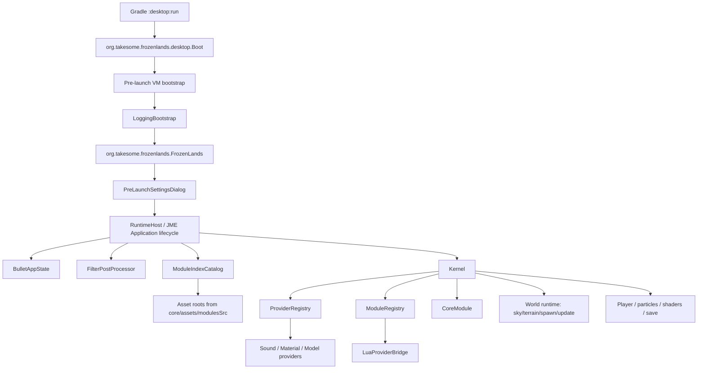

# FrozenLands — техническое описание проекта

> Состояние: актуальная инспекция через NorthStar Suite V2, рабочее дерево `C:\Users\Aiden\Documents\Repos\FrozenLands-main`, дата фиксации: `2026-06-26`.
>
> Документ описывает текущий multi-project Gradle layout, рабочую директорию запуска, runtime-модули, зависимости, диагностические команды и обнаруженные расхождения.

---

## 1. Идентификация

| Поле | Значение |
|---|---|
| Project name | `Take Some() Frozen Lands` |
| Gradle root project | `FrozenLands` |
| Project id | `takesome.frozenlands` |
| Namespace | `org.takesome.frozenlands` |
| Тип | Java / jMonkeyEngine game-runtime prototype |
| Статус | alpha development workspace |
| Root version | `org.takesome:FrozenLands:1.4.2` |
| Основной игровой класс | `org.takesome.frozenlands.FrozenLands` |
| Gradle application entrypoint | `org.takesome.frozenlands.desktop.Boot` |
| Project index entrypoint | `org.takesome.frozenlands.desktop.DesktopLauncher` |
| Runtime working directory | `C:\Users\Aiden\Documents\Repos\FrozenLands-main` |

`FrozenLands` — это Java / jMonkeyEngine runtime-прототип холодного open-world проекта. Репозиторий сейчас устроен как Gradle multi-project workspace: core runtime, desktop launcher, public assets и набор runtime/provider-модулей в `modulesSrc`.

---

## 2. Локальные пути и рабочие директории

```text
Workspace root:
C:\Users\Aiden\Documents\Repos

Main repository:
C:\Users\Aiden\Documents\Repos\FrozenLands-main

Local sky dependency repository:
C:\Users\Aiden\Documents\Repos\SkySimulation

NorthStar tool root:
C:\Users\Aiden\Documents\Take Some\NorthStar-Suite
```

### Каноническая рабочая директория запуска

`desktop/build.gradle` задаёт для `:desktop:run`:

```groovy
tasks.named('run', JavaExec) {
    workingDir = rootProject.projectDir
}
```

То есть runtime должен запускаться из:

```bat
cd C:\Users\Aiden\Documents\Repos\FrozenLands-main
gradlew.bat :desktop:run
```

Корневой task `run` просто делегирует запуск в `:desktop:run`:

```bat
gradlew.bat run
```

---

## 3. Подтверждённая Gradle-структура

Команда:

```bat
gradlew.bat -q projects
```

возвращает следующую иерархию:

```text
Root project 'FrozenLands'
+--- Project ':assets'
+--- Project ':bootstrap'
+--- Project ':core'
+--- Project ':desktop'
+--- Project ':ico-parser'
+--- Project ':particles'
+--- Project ':player'
+--- Project ':provider-core'
+--- Project ':provider-material'
+--- Project ':provider-model'
+--- Project ':provider-sound'
+--- Project ':save'
+--- Project ':shaders'
+--- Project ':sky'
+--- Project ':terrain'
+--- Project ':weather'
\--- Project ':world'
```

### Расположение Gradle subprojects

| Gradle project | Path |
|---|---|
| `:assets` | `assets` |
| `:core` | `core` |
| `:desktop` | `desktop` |
| `:bootstrap` | `modulesSrc/bootstrap` |
| `:ico-parser` | `modulesSrc/ico-parser` |
| `:particles` | `modulesSrc/particles` |
| `:player` | `modulesSrc/player` |
| `:provider-core` | `modulesSrc/provider-core` |
| `:provider-material` | `modulesSrc/provider-material` |
| `:provider-model` | `modulesSrc/provider-model` |
| `:provider-sound` | `modulesSrc/provider-sound` |
| `:save` | `modulesSrc/save` |
| `:shaders` | `modulesSrc/shaders` |
| `:sky` | `modulesSrc/sky` |
| `:terrain` | `modulesSrc/terrain` |
| `:weather` | `modulesSrc/weather` |
| `:world` | `modulesSrc/world` |

---

## 4. Верхнеуровневая структура репозитория

```text
FrozenLands-main/
├── assets/                         # public mutable runtime assets
│   ├── MatDefs/
│   ├── Models/
│   ├── sounds/
│   ├── textures/
│   ├── themes/
│   ├── ui/
│   ├── FrozenLands.ico
│   ├── build.gradle
│   └── module.index.json
├── core/                           # основной Java runtime / engine core
│   ├── build.gradle
│   ├── module.index.json
│   └── src/main/java/org/takesome/frozenlands/
├── desktop/                        # desktop launcher / Gradle application
│   ├── build.gradle
│   └── src/main/java/org/takesome/frozenlands/desktop/
├── modulesSrc/                     # production runtime modules + Lua API/config/assets
│   ├── bootstrap/
│   ├── ico-parser/
│   ├── particles/
│   ├── player/
│   ├── provider-core/
│   ├── provider-material/
│   ├── provider-model/
│   ├── provider-sound/
│   ├── save/
│   ├── shaders/
│   ├── sky/
│   ├── terrain/
│   ├── weather/
│   └── world/
├── gradle/wrapper/gradle-wrapper.properties
├── build.gradle
├── settings.gradle
├── project.index.json
├── README.md
├── RELEASE_NOTES_1.4.2.md
├── INITIAL.md
├── bulletjme.dll
├── libvlc.dll
├── lwjgl64.dll
└── OpenAL64.dll
```

### Core package roots

```text
core/src/main/java/org/takesome/frozenlands
├── FrozenLands.java
├── engine/
│   ├── Kernel.java
│   ├── EngineContext.java
│   ├── bootstrap/
│   ├── config/
│   ├── core/console/
│   ├── events/
│   ├── lua/
│   ├── modules/
│   ├── resources/
│   ├── utils/
│   └── world/
│       ├── sky/
│       └── spawn/
├── launch/
└── logging/
```

### Desktop launchers

```text
desktop/src/main/java/org/takesome/frozenlands/desktop/Boot.java
desktop/src/main/java/org/takesome/frozenlands/desktop/DesktopLauncher.java
```

`Boot` — фактический Gradle entrypoint. Он выполняет pre-launch bootstrap, ставит logging bootstrap и рефлексивно вызывает `org.takesome.frozenlands.FrozenLands.main()`.

`DesktopLauncher` — прямой launcher, указанный в `project.index.json`; он ставит `LoggingBootstrap` и вызывает `FrozenLands.main(args)`.

---

## 5. Runtime flow



### Смысл `FrozenLands`

`FrozenLands` реализует `com.jme3.app.Application`, а не просто наследует `SimpleApplication`. Внутри он держит собственный `RuntimeHost`, `rootNode`, `guiNode`, `BulletAppState`, `FilterPostProcessor` и подключает `Kernel` как центральный engine state.

Основные операции на старте:

1. установка logging bootstrap;
2. открытие pre-launch settings dialog;
3. установка window icon `FrozenLands.ico`;
4. регистрация asset roots;
5. чтение bootstrap-конфига;
6. создание Bullet physics state;
7. создание post-processing pipeline;
8. подключение `Kernel`;
9. запуск world/player/module runtime.

---

## 6. Build system и зависимости

### Gradle wrapper

```text
Gradle: 9.6.0
Wrapper: gradle/wrapper/gradle-wrapper.properties
Distribution: https://services.gradle.org/distributions/gradle-9.6.0-bin.zip
```

### Root build.gradle

Root project использует plugin:

```groovy
plugins {
    id 'base'
}
```

Общие координаты:

```groovy
group = 'org.takesome'
version = '1.4.2'
```

Repositories:

```groovy
mavenLocal()
mavenCentral()
maven { url = uri('https://jitpack.io') }
```

JME принудительно выравнивается для всех subprojects:

```groovy
resolutionStrategy.eachDependency { details ->
    if (details.requested.group == 'org.jmonkeyengine') {
        details.useVersion '3.9.0-stable'
    }
}
```

### Core dependencies

`core/build.gradle` — главный dependency hub runtime:

| Категория | Dependency |
|---|---|
| jMonkeyEngine | `jme3-core`, `jme3-desktop`, `jme3-lwjgl3`, `jme3-awt-dialogs`, `jme3-plugins`, `jme3-terrain`, `jme3-effects`, `jme3-jogg` pinned to `3.9.0-stable` |
| Physics | `com.github.stephengold:Minie:8.2.0` |
| Sky / atmosphere | `dev.takesome:sky-simulation:1.4.1` |
| Utilities | `com.github.stephengold:Heart:9.2.0` |
| JSON | `jackson-databind:2.22.0`, `gson:2.14.0` |
| Lua | `org.luaj:luaj-jse:3.0.1` |
| Logging | `log4j-api/core/slf4j2-impl:2.26.0`, `slf4j-api:2.0.17`, `jul-to-slf4j:2.0.17`, `jansi:2.4.2` |

### Java baseline

README декларирует Java `17+`. В Gradle source/target compatibility явно не зафиксированы в корневом build-файле; практический baseline определяется Gradle `9.6.0`, JME/LWJGL/Minie stack и текущей JDK разработчика.

---

## 7. Source graph

`core/build.gradle` делает важную вещь: он добавляет Java source dirs из `modulesSrc/*/src/main/java`, но только для директорий, где есть `module.index.json`.

```groovy
def modulesRoot = rootProject.file('modulesSrc')
def moduleDirs = modulesRoot.exists()
    ? modulesRoot.listFiles().findAll { it.isDirectory() && new File(it, 'module.index.json').exists() }.sort { it.name }
    : []
def moduleJavaSourceDirs = moduleDirs.collect { new File(it, 'src/main/java') }.findAll { it.exists() }

sourceSets {
    main {
        java.srcDirs = [file('src/main/java')] + moduleJavaSourceDirs
        resources.srcDirs = [file('src/main/resources')]
    }
}
```

Следствие: runtime-модули одновременно существуют как Gradle subprojects, но desktop application фактически компилирует их Java-код через `:core` source set. Это подтверждается smoke-командой `gradlew.bat :desktop:classes`: были задействованы только `:core:compileJava` и `:desktop:compileJava`.

---

## 8. Runtime module catalog

Модули объявляются через:

```text
core/module.index.json
assets/module.index.json
modulesSrc/*/module.index.json
```

### Основные модули

| Module ID | Gradle/project path | Тип | Назначение |
|---|---|---|---|
| `engine.core` | `core` | core | Core Lua bridge, scripting support, console/runtime bridge. |
| `assets.public` | `assets` | assets | Public mutable assets; asset root is `assets/.`. |
| `engine.bootstrap` | `modulesSrc/bootstrap` | bootstrap | Startup config, включая user input mappings. |
| `engine.providers` | `modulesSrc/provider-core` | provider-core | Provider registry и provider command/event ABI. |
| `engine.material` | `modulesSrc/provider-material` | provider | Material loading/list/get. |
| `engine.model` | `modulesSrc/provider-model` | provider | Model loading/attach/detach/list. |
| `engine.sound` | `modulesSrc/provider-sound` | provider | Sound config, loading, playback. |
| `engine.world` | `modulesSrc/world` | runtime | World state / spawn API. |
| `engine.terrain` | `modulesSrc/terrain` | runtime | Terrain chunks, height queries, spawn location, terrain config. |
| `engine.shaders` | `modulesSrc/shaders` | runtime | Post-processing and shadow settings. |
| `engine.particles` | `modulesSrc/particles` | runtime | Snow, emit and impact effects. |
| `engine.player` | `modulesSrc/player` | runtime | Movement, camera look, physics, HUD API. |
| `engine.save` | `modulesSrc/save` | runtime | Snapshot, save, load, list. |
| `engine.icoParser` | `modulesSrc/ico-parser` | runtime | ICO parsing, frame inspection, icon size selection. |
| `engine.sky` | `modulesSrc/sky` | runtime | Sky command bridge, atmosphere/weather/clock/environment commands. |
| `engine.weather` | `modulesSrc/weather` | runtime | Frostpunk-style snow precipitation, wind and weather state API. |

### Module ABI

`ModuleRegistry` предоставляет:

```java
EngineModule register(EngineModule module, EngineContext context)
Optional<EngineModule> find(String id)
EngineModule require(String id)
Map<String, Object> call(String moduleId, String commandId, Map<String, Object> arguments)
Map<String, Object> publishEvent(String topic, Map<String, Object> payload)
Map<String, Object> publishLiveEvent(String topic, Map<String, Object> payload)
Map<String, EngineModule> snapshot()
Map<String, Object> luaManifest()
```

`LuaProviderBridge` экспортирует runtime manifest и связывает Lua-facing API с Java module/provider execution.

---

## 9. Sky / weather layer

Текущий core зависит от:

```groovy
api 'dev.takesome:sky-simulation:1.4.1'
```

Рядом в workspace также существует локальный репозиторий:

```text
C:\Users\Aiden\Documents\Repos\SkySimulation
```

`Sky.java` использует API из `jme3utilities.sky` и расширения command/runtime слоя:

```java
import jme3utilities.sky.SkyControl;
import jme3utilities.sky.StarsOption;
import jme3utilities.sky.Updater;
import jme3utilities.sky.command.SkyCommandBus;
import jme3utilities.sky.runtime.SkyEnvironmentSnapshot;
```

Текущая sky initialization:

| Параметр | Значение |
|---|---|
| Cubemap texture | `textures/FullskiesSunset0068.dds` |
| Skybox factory | `SkyFactory.createSky(..., EnvMapType.CubeMap)` |
| Stars option | `StarsOption.TopDome` |
| Cloudiness | `0.8f` |
| Clouds Y offset | `0.4f` |
| Top vertical angle | `1.78f` |
| Initial hour | `11` |

`RuntimeManifestReporter` ожидает у `engine.sky` команды:

```text
status
command.execute
atmosphere.setGradient
weather.set
weather.list
clock.setTime
environment.snapshot
```

---

## 10. Asset model

Главный mutable asset root:

```text
assets/
```

`assets/module.index.json` объявляет:

```json
{
  "id": "assets.public",
  "type": "assets",
  "runtime": {
    "configs": {},
    "assetRoots": ["."]
  }
}
```

Активные asset/resource типы, обнаруженные в `assets`, `core/src/main/resources` и `modulesSrc`:

| Extension | Count |
|---|---:|
| `.java` | 781 в `modulesSrc`, плюс 56 в `core`, 2 в `desktop` |
| `.png` | 131 |
| `.ogg` | 114 |
| `.lua` | 41 |
| `.json` | 36 |
| `.txt` | 24 |
| `.jpg` | 18 |
| `.css` | 15 |
| `.md` | 14 |
| `.ttf` | 6 |
| `.gltf` | 5 |
| `.bin` | 5 |
| `.ico` | 1 |
| `.dds` | 1 |
| shader/material/config files | `.frag`, `.vert`, `.j3md`, `.groovy`, `.xml`, custom engine descriptors |

Native/runtime-sensitive files in repository root:

```text
bulletjme.dll
libvlc.dll
lwjgl64.dll
OpenAL64.dll
```

Не удалять без проверки того, что текущий Gradle/JME/LWJGL/Minie runtime поставляет эквивалентные natives.

---

## 11. Diagnostics

### Gradle project discovery

```bat
cd C:\Users\Aiden\Documents\Repos\FrozenLands-main
gradlew.bat -q projects
```

Status: successful.

### Compile smoke

```bat
cd C:\Users\Aiden\Documents\Repos\FrozenLands-main
gradlew.bat :desktop:classes --console=plain
```

Observed result:

```text
> Task :core:compileJava UP-TO-DATE
> Task :desktop:compileJava UP-TO-DATE
> Task :desktop:processResources NO-SOURCE
> Task :desktop:classes UP-TO-DATE
BUILD SUCCESSFUL
```

### Runtime manifest flags

`RuntimeManifestReporter` listens to:

```text
-Dfrozenlands.runtimeManifest=true
```

It reports providers/modules and validates key commands for:

```text
engine.core
engine.save
engine.particles
engine.terrain
engine.sky
engine.shaders
engine.sound
engine.material
engine.model
engine.icoParser
```

There is no `runtimeManifestExit` handling in the currently inspected `RuntimeManifestReporter` source excerpt; if an exit-on-manifest mode is needed, verify implementation before documenting it as supported.

---

## 12. Git state at inspection time

```text
## main...origin/main
 M core/src/main/java/org/takesome/frozenlands/engine/core/console/CoreConsoleState.java
```

Meaning: branch `main` tracks `origin/main`; one local file is modified.

---

## 13. Notable inconsistencies / cleanup targets

### 13.1 Entrypoint mismatch

There are three relevant entrypoints:

| Location | Entrypoint |
|---|---|
| `desktop/build.gradle` | `org.takesome.frozenlands.desktop.Boot` |
| `project.index.json` | `org.takesome.frozenlands.desktop.DesktopLauncher` |
| Runtime class | `org.takesome.frozenlands.FrozenLands` |

For Gradle execution, `Boot` is canonical. `project.index.json` should either be updated to `Boot` or explicitly document that `DesktopLauncher` is a direct/manual launcher.

### 13.2 `project.index.json` is missing current module entries

`settings.gradle` includes `:sky` and `:weather`, and both directories contain `module.index.json`, but `project.index.json.modules` currently lists modules only up to `engine.icoParser`. Add entries for:

```text
engine.sky      -> modulesSrc/sky
engine.weather  -> modulesSrc/weather
```

### 13.3 `modulesSrc/engine-ui` is present but not active in FrozenLands Gradle hierarchy

Observed:

```text
modulesSrc/engine-ui
index=False
build=True
java=708
resources=53
```

It is not included by `settings.gradle` and has no `module.index.json`. It also references project names such as `:engine-assets`, `:engine-materials`, `:engine-events`, etc., which are not part of the current `FrozenLands` project hierarchy.

Treat `engine-ui` as legacy/imported/dormant code until explicitly integrated.

### 13.4 Runtime module compilation model needs a decision

Current model:

1. `modulesSrc/*` are included as Gradle subprojects.
2. `core` also imports their Java source directories directly into its own `main` source set.
3. `desktop` depends only on `:core`.

This is functional, but architecturally ambiguous. Choose one of two directions:

- **Embedded runtime modules:** keep compiling modules into `core`, and remove/soften standalone module subprojects unless needed for tests.
- **True Gradle module graph:** make `:core` expose SPI only, then make `:desktop` depend on explicit runtime module projects or load them dynamically.

---

## 14. Commands cheat sheet

```bat
REM Show project hierarchy
cd C:\Users\Aiden\Documents\Repos\FrozenLands-main
gradlew.bat -q projects

REM Compile desktop smoke
gradlew.bat :desktop:classes --console=plain

REM Run game through root delegating task
gradlew.bat run

REM Run game through canonical desktop project
gradlew.bat :desktop:run

REM Inspect git state
git status --short --branch
```

---

## 15. Practical description for README / external summary

**FrozenLands** is an alpha Java / jMonkeyEngine game-runtime prototype by Take Some(). The project is structured as a Gradle multi-project workspace with a core engine runtime, a desktop launcher, mutable public assets, and modular Java/Lua runtime systems under `modulesSrc`. The engine initializes a JME application lifecycle, Bullet/Minie physics, asset roots, post-processing, provider registries, module registries, Lua-facing command/event bridges, terrain, sky/atmosphere, weather, particles, player control, shaders, and save/runtime diagnostics.

The canonical local launch path is:

```bat
cd C:\Users\Aiden\Documents\Repos\FrozenLands-main
gradlew.bat :desktop:run
```

The canonical working directory at runtime is the repository root:

```text
C:\Users\Aiden\Documents\Repos\FrozenLands-main
```
